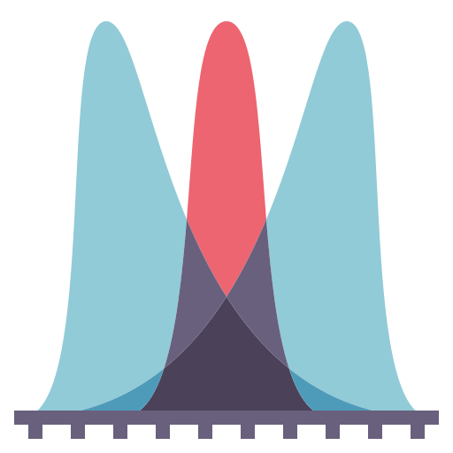

# Bienvenidos a ICS294!

## Descripción 

Asignatura teórico-práctica orientada a la aplicación de métodos estadísticos y econométricos para el análisis, modelamiento y evaluación de fenómenos económicos y sociales. El curso enfatiza el uso de modelos de regresión, análisis de datos reales y la correcta interpretación de resultados obtenidos mediante software especializado, incorporando criterios de inferencia, diagnóstico y validación de modelos.

```{=html}
<div class="ai-tools-grid">

  <!-- Copilot Card -->
  <div class="copilot-card">
    <div class="copilot-header">
      <svg width="28" height="28" viewBox="0 0 48 48" fill="none" xmlns="http://www.w3.org/2000/svg">
        <rect x="4" y="4" width="18" height="18" rx="2" fill="#f25022"/>
        <rect x="26" y="4" width="18" height="18" rx="2" fill="#7fba00"/>
        <rect x="4" y="26" width="18" height="18" rx="2" fill="#00a4ef"/>
        <rect x="26" y="26" width="18" height="18" rx="2" fill="#ffb900"/>
      </svg>
      <div>
        <span class="copilot-label">Recurso disponible en</span>
        <strong class="copilot-brand">Microsoft 365 Copilot</strong>
      </div>
    </div>
    <p class="copilot-desc">
      Accede al asistente del curso para explorar el material con inteligencia artificial.
      Puedes hacer preguntas sobre modelos de regresión, econometría y análisis de datos,
      obtener explicaciones y profundizar en los contenidos de ICS294.
    </p>
    <div class="copilot-links">
      <a href="https://m365.cloud.microsoft/chat/?titleId=T_4a12b530-b039-fdcc-a8cc-fa3853979a83&source=embedded-builder" target="_blank" class="copilot-btn">
        📊 Asistente ICS294 – Econometría
      </a>
    </div>
  </div>

  <!-- NotebookLM Card -->
  <div class="notebooklm-card">
    <div class="notebooklm-header">
      <svg width="28" height="28" viewBox="0 0 48 48" fill="none" xmlns="http://www.w3.org/2000/svg">
        <path d="M24 4C13 4 4 13 4 24s9 20 20 20 20-9 20-20S35 4 24 4z" fill="#1a73e8" opacity="0.15"/>
        <path d="M8 24c0-8.8 7.2-16 16-16" stroke="#1a73e8" stroke-width="3.5" stroke-linecap="round"/>
        <path d="M13 24c0-6.1 4.9-11 11-11" stroke="#1a73e8" stroke-width="3.5" stroke-linecap="round"/>
        <path d="M18 24c0-3.3 2.7-6 6-6" stroke="#1a73e8" stroke-width="3.5" stroke-linecap="round"/>
      </svg>
      <div>
        <span class="notebooklm-label">Recursos disponibles en</span>
        <strong class="notebooklm-brand">NotebookLM</strong>
      </div>
    </div>
    <p class="notebooklm-desc">
      Accede a los notebooks del curso para explorar el material con inteligencia artificial. Puedes hacer preguntas, obtener resúmenes, generar explicaciones alternativas y profundizar en los contenidos de ICS294 a tu propio ritmo.
    </p>
    <div class="notebooklm-links">
      <a href="https://notebooklm.google.com/notebook/0a216414-3796-460a-9b62-9badf7c1618c" target="_blank" class="notebooklm-btn">
        📊 Econometría
      </a>
      <a href="https://notebooklm.google.com/notebook/1431805c-e3e8-4951-b23d-0f45e57c0e1e" target="_blank" class="notebooklm-btn">
        📈 Probabilidad y Estadística
      </a>
    </div>
  </div>

</div>

<style>
/* --- Grid layout --- */
.ai-tools-grid {
  display: grid;
  grid-template-columns: 1fr 1fr;
  gap: 1.25rem;
  margin: 1.5rem 0;
  align-items: start;
}
@media (max-width: 640px) {
  .ai-tools-grid {
    grid-template-columns: 1fr;
  }
}

/* --- Copilot card --- */
.copilot-card {
  background: linear-gradient(135deg, #f0f4ff 0%, #e8f0fe 100%);
  border: 1px solid #c2d4f0;
  border-left: 4px solid #0078d4;
  border-radius: 12px;
  padding: 1.4rem 1.6rem;
  font-family: inherit;
}
.copilot-header {
  display: flex;
  align-items: center;
  gap: 0.75rem;
  margin-bottom: 0.75rem;
}
.copilot-label {
  display: block;
  font-size: 0.78rem;
  color: #5f6368;
  text-transform: uppercase;
  letter-spacing: 0.05em;
}
.copilot-brand {
  font-size: 1.05rem;
  color: #0078d4;
}
.copilot-desc {
  font-size: 0.92rem;
  color: #3c4043;
  margin: 0 0 1rem 0;
  line-height: 1.55;
}
.copilot-links {
  display: flex;
  gap: 0.75rem;
  flex-wrap: wrap;
}
.copilot-btn {
  display: inline-block;
  padding: 0.5rem 1rem;
  background: #0078d4;
  color: white !important;
  border-radius: 8px;
  text-decoration: none !important;
  font-size: 0.88rem;
  font-weight: 500;
  transition: background 0.2s, transform 0.15s;
}
.copilot-btn:hover {
  background: #005a9e;
  transform: translateY(-1px);
}

/* --- NotebookLM card --- */
.notebooklm-card {
  background: linear-gradient(135deg, #f0f7ff 0%, #e8f0fe 100%);
  border: 1px solid #c5d8f7;
  border-left: 4px solid #1a73e8;
  border-radius: 12px;
  padding: 1.4rem 1.6rem;
  font-family: inherit;
}
.notebooklm-header {
  display: flex;
  align-items: center;
  gap: 0.75rem;
  margin-bottom: 0.75rem;
}
.notebooklm-label {
  display: block;
  font-size: 0.78rem;
  color: #5f6368;
  text-transform: uppercase;
  letter-spacing: 0.05em;
}
.notebooklm-brand {
  font-size: 1.05rem;
  color: #1a73e8;
}
.notebooklm-desc {
  font-size: 0.92rem;
  color: #3c4043;
  margin: 0 0 1rem 0;
  line-height: 1.55;
}
.notebooklm-links {
  display: flex;
  gap: 0.75rem;
  flex-wrap: wrap;
}
.notebooklm-btn {
  display: inline-block;
  padding: 0.5rem 1rem;
  background: #1a73e8;
  color: white !important;
  border-radius: 8px;
  text-decoration: none !important;
  font-size: 0.88rem;
  font-weight: 500;
  transition: background 0.2s, transform 0.15s;
}
.notebooklm-btn:hover {
  background: #1558b0;
  transform: translateY(-1px);
}
</style>
```


```{=html}
<div class="github-card">
  <div class="github-header">
    <svg width="22" height="22" viewBox="0 0 24 24" fill="currentColor" class="github-icon">
      <path d="M12 0C5.37 0 0 5.37 0 12c0 5.31 3.435 9.795 8.205 11.385.6.105.825-.255.825-.57 0-.285-.015-1.23-.015-2.235-3.015.555-3.795-.735-4.035-1.41-.135-.345-.72-1.41-1.23-1.695-.42-.225-1.02-.78-.015-.795.945-.015 1.62.87 1.845 1.23 1.08 1.815 2.805 1.305 3.495.99.105-.78.42-1.305.765-1.605-2.67-.3-5.46-1.335-5.46-5.925 0-1.305.465-2.385 1.23-3.225-.12-.3-.54-1.53.12-3.18 0 0 1.005-.315 3.3 1.23.96-.27 1.98-.405 3-.405s2.04.135 3 .405c2.295-1.56 3.3-1.23 3.3-1.23.66 1.65.24 2.88.12 3.18.765.84 1.23 1.905 1.23 3.225 0 4.605-2.805 5.625-5.475 5.925.435.375.81 1.095.81 2.22 0 1.605-.015 2.895-.015 3.3 0 .315.225.69.825.57A12.02 12.02 0 0 0 24 12c0-6.63-5.37-12-12-12z"/>
    </svg>
    <div>
      <span class="github-label">Entregables del curso en</span>
      <strong class="github-brand">GitHub</strong>
    </div>
  </div>
  <p class="github-desc">
    Todos los entregables se gestionan a través de GitHub. Crea una cuenta gratuita
    y clona el repositorio del curso usando el botón <strong>Use this template</strong>.
  </p>
  <div class="github-repo">
    <svg width="14" height="14" viewBox="0 0 24 24" fill="currentColor" style="flex-shrink:0; opacity:0.5"><path d="M12 0C5.37 0 0 5.37 0 12c0 5.31 3.435 9.795 8.205 11.385.6.105.825-.255.825-.57 0-.285-.015-1.23-.015-2.235-3.015.555-3.795-.735-4.035-1.41-.135-.345-.72-1.41-1.23-1.695-.42-.225-1.02-.78-.015-.795.945-.015 1.62.87 1.845 1.23 1.08 1.815 2.805 1.305 3.495.99.105-.78.42-1.305.765-1.605-2.67-.3-5.46-1.335-5.46-5.925 0-1.305.465-2.385 1.23-3.225-.12-.3-.54-1.53.12-3.18 0 0 1.005-.315 3.3 1.23.96-.27 1.98-.405 3-.405s2.04.135 3 .405c2.295-1.56 3.3-1.23 3.3-1.23.66 1.65.24 2.88.12 3.18.765.84 1.23 1.905 1.23 3.225 0 4.605-2.805 5.625-5.475 5.925.435.375.81 1.095.81 2.22 0 1.605-.015 2.895-.015 3.3 0 .315.225.69.825.57A12.02 12.02 0 0 0 24 12c0-6.63-5.37-12-12-12z"/></svg>
    <code>fralfaro/ics194-entregables</code>
  </div>
  <div class="github-links">
    <a href="https://github.com/signup" target="_blank" class="github-btn github-btn-outline">
      Crear cuenta
    </a>
    <a href="https://github.com/fralfaro/ics194-entregables" target="_blank" class="github-btn github-btn-green">
      Use this template →
    </a>
  </div>
</div>

<style>
.github-card {
  background: #f6f8fa;
  border: 1px solid #d0d7de;
  border-left: 4px solid #24292f;
  border-radius: 10px;
  padding: 1.2rem 1.5rem;
  margin: 1.5rem 0;
  font-family: inherit;
}
.github-header {
  display: flex;
  align-items: center;
  gap: 10px;
  margin-bottom: 0.65rem;
}
.github-icon { opacity: 0.85; }
.github-label {
  display: block;
  font-size: 0.75rem;
  color: #57606a;
  text-transform: uppercase;
  letter-spacing: 0.05em;
}
.github-brand {
  font-size: 1rem;
  color: #24292f;
}
.github-desc {
  font-size: 0.9rem;
  color: #444d56;
  margin: 0 0 0.85rem 0;
  line-height: 1.55;
}
.github-repo {
  display: flex;
  align-items: center;
  gap: 8px;
  background: white;
  border: 1px solid #d0d7de;
  border-radius: 6px;
  padding: 7px 12px;
  margin-bottom: 1rem;
}
.github-repo code {
  font-size: 0.83rem;
  color: #24292f;
}
.github-links {
  display: flex;
  gap: 8px;
  flex-wrap: wrap;
}
.github-btn {
  display: inline-block;
  padding: 5px 14px;
  border-radius: 6px;
  font-size: 0.85rem;
  font-weight: 500;
  text-decoration: none !important;
  transition: opacity 0.15s;
}
.github-btn:hover { opacity: 0.85; }
.github-btn-outline {
  background: white;
  color: #24292f !important;
  border: 1px solid #d0d7de;
}
.github-btn-green {
  background: #2da44e;
  color: white !important;
  border: 1px solid #2c974b;
}
</style>
```


## Secciones


```{=html}
<div class="nt-cards nt-grid cols-4">

  <a class="nt-card" href="material/modulo_01/index.qmd">
    <div class="nt-card-image">
      
    </div>
    <div class="nt-card-body">
      <h3>Modelos de Regresión</h3>
      <p>
        Estimación e interpretación de modelos de regresión simple y múltiple (supuestos, vatiables dummies, etc.).
      </p>
    </div>
  </a>

  <a class="nt-card" href="material/modulo_02/index.qmd">
    <div class="nt-card-image">
      
    </div>
    <div class="nt-card-body">
      <h3>Inferencia Estadística</h3>
      <p>
        Intervalos de confianza, pruebas de hipótesis, significancia estadística de coeficientes y calidad del ajuste.
      </p>
    </div>
  </a>

  <a class="nt-card" href="material/modulo_03/index.qmd">
    <div class="nt-card-image">
      
    </div>
    <div class="nt-card-body">
      <h3>Aplicaciones Avanzadas</h3>
      <p>
       Análisis econométricos aplicados a series de tiempo y modelos estocásticos simples (como random walk).
      </p>
    </div>

  <a class="nt-card" href="material/anexos/estadistica_descriptiva_r.qmd">
    <div class="nt-card-image">
      
    </div>
    <div class="nt-card-body">
      <h3>Repaso Estadística y Probabilidad</h3>
      <p>
        Material de repaso: estadística descriptiva, variables aleatorias, inferencial e introducción a R con Google Colab.
      </p>
    </div>
  </a>

</div>


```
