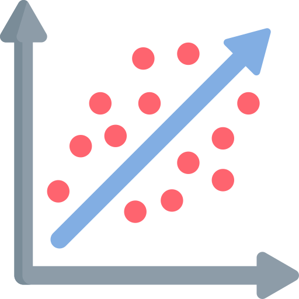
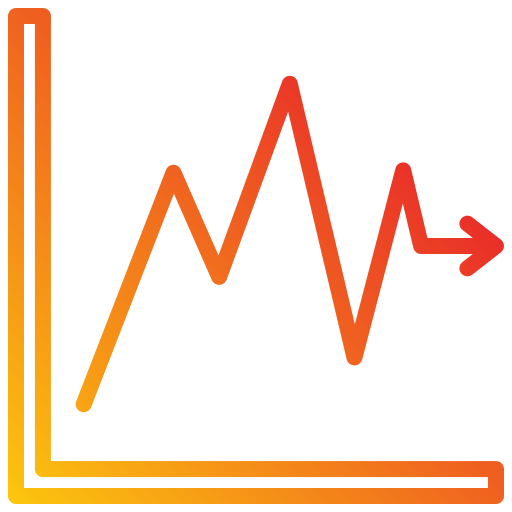

# Bienvenidos a ICS294!

## Descripción 

Asignatura teórico-práctica orientada a la aplicación de métodos estadísticos y econométricos para el análisis, modelamiento y evaluación de fenómenos económicos y sociales. El curso enfatiza el uso de modelos de regresión, análisis de datos reales y la correcta interpretación de resultados obtenidos mediante software especializado, incorporando criterios de inferencia, diagnóstico y validación de modelos.


## Contenidos 

- Muestreo y análisis exploratorio de datos  
- Naturaleza de la econometría y tipos de datos económicos  
- Modelo de regresión lineal simple  
- Modelo de regresión lineal múltiple  
- Variables dummy y variables cualitativas  
- Heterocedasticidad  
- Regresión con datos de series de tiempo  
- Introducción a econometría espacial  
- Introducción al análisis multivariado  

## Secciones


```{=html}
<div class="nt-cards nt-grid cols-3">

  <a class="nt-card" href="material/modulo_01/index.qmd">
    <div class="nt-card-image">
      
    </div>
    <div class="nt-card-body">
      <h3>Modelos de Regresión</h3>
      <p>
        Estimación e interpretación de modelos de regresión simple y múltiple (supuestos, vatiables dummies, etc.).
      </p>
    </div>
  </a>

  <a class="nt-card" href="material/modulo_02/index.qmd">
    <div class="nt-card-image">
      
    </div>
    <div class="nt-card-body">
      <h3>Inferencia Estadística</h3>
      <p>
        Intervalos de confianza, pruebas de hipótesis, significancia estadística de coeficientes y evaluación de la calidad del ajuste.
      </p>
    </div>
  </a>

  <a class="nt-card" href="material/modulo_03/index.qmd">
    <div class="nt-card-image">
      
    </div>
    <div class="nt-card-body">
      <h3>Aplicaciones Avanzadas</h3>
      <p>
       Análisis econométricos aplicados a series de tiempo y modelos estocásticos simples (como random walk).
      </p>
    </div>
  </a>

</div>


```
