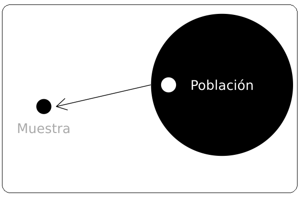
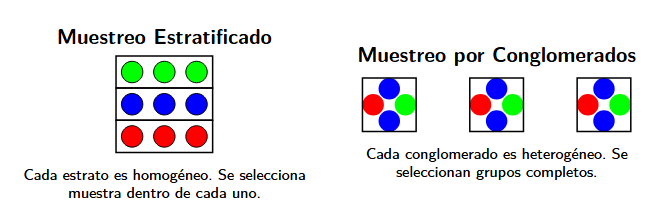

# Introducción

## ¿Qué es econometría?

- Disciplina que emplea la teoría económica y métodos estadísticos para contrastar teorías, pronosticar variables y evaluar políticas públicas.
- Es una aplicación del método científico en economía. Permite refutar hipótesis económicas.
- Nos permite contestar preguntas como:

1. ¿Cuál es la brecha salarial por género?
2. ¿Cuál es el efecto de haber completado la universidad en el salario?

## Econometría moderna

La econometría moderna se enfoca en contestar tres tipos de preguntas:

- Estimar cómo la esperanza condicional de una variable depende de otra.
- Estimar el impacto causal de una variable sobre otra.
- Predecir el comportamiento de una variable hacia el futuro.

## Método econométrico

**Definir el objetivo:** ¿qué quiero estudiar?

### 1. Modelo económico

Modelos que explican el comportamiento de una variable en función de otras:

$$Y = f(x_1, x_2, \dots, x_k)$$

**Ejemplo 1:** Función de producción

$$Y = AK^{\alpha} L^{\beta}$$

**Ejemplo 2:** Retornos a la educación

$$\text{salario} = f(\text{educación}, \text{experiencia}, \text{ingreso familiar}, \text{habilidad})$$

## Método econométrico (cont.)

### 2. Modelo econométrico

Permite cuantificar, contrastar y evaluar el modelo económico.

- Especificar la función $f(\cdot)$.
- Las variables económicas son aleatorias → se incorpora un término de error:

$$y = f(x_1, x_2, \dots, x_k) + u$$

- Uso de datos.

## Causalidad y correlación

**Correlación no es causalidad**

- Muchas veces nos interesa conocer el efecto causal de una variable sobre otra.
- El concepto *ceteris paribus* es clave: efecto de $X$ sobre $Y$ manteniendo todos los demás factores constantes.
- Muy difícil de lograr en la práctica en ciencias sociales.

**Correlación espuria:** existe una relación matemática, pero los factores no tienen una relación lógica.

## Ejemplo

**Información:** en una base de datos de individuos de 35 años en Chile, las personas que terminaron la universidad ganan un 30% más que quienes no la terminaron.

**Pregunta:** ¿puedo concluir que ir a la universidad *causa* un aumento del ingreso?

. . .

**No se puede concluir eso directamente.**

- Ir a la universidad está asociado a muchas otras características que también afectan el ingreso.
- Por ejemplo: habilidad, ingreso de los padres, entre otras.

## Econometría como herramienta aplicada

**Parásitos intestinales en África**

Miguel y Kremer (2004) muestran que repartir pastillas en colegios mejora la salud y reduce el ausentismo, incluso en vecinos no tratados.
→ *Deworming the World* ha recaudado billones de dólares para esta política.

**Productividad de firmas**

Bloom et al. (2017) muestran que las consultoras de management mejoran la productividad de las firmas en India y cuantifican el efecto.

## Tipos de datos

| Tipo | Descripción |
|---|---|
| **Experimentales** | El investigador asigna aleatoriamente la exposición |
| **Pseudo-experimentales** | El investigador controla pero no asigna aleatoriamente |
| **Observacionales** | El investigador no controla la exposición |

El uso de datos experimentales es poco frecuente por su alto costo y problemas éticos.

## Datos de corte transversal

- Muestra de individuos, hogares, empresas, regiones o países recolectados en un momento determinado.
- Se asumen diferencias temporales menores como irrelevantes.
- Se asume **muestreo aleatorio** desde la población subyacente.

## Series de tiempo

Observaciones de una o más variables a lo largo del tiempo.

Ejemplos: precios de acciones, tipo de cambio, IPC, ventas de automóviles.

- Los eventos pasados influyen en los futuros.
- Los rezagos son frecuentes en ciencias sociales.
- Frecuencia: diaria, mensual, trimestral, anual, etc.
- A diferencia del corte transversal, las observaciones **no son independientes**.

## Datos de panel

Datos longitudinales: series de tiempo para cada unidad del conjunto de datos.

**Ejemplo:** 10 años de datos de salario, educación y empleo para un grupo de individuos.

**Ventajas:**

- Control de características no observadas.
- Facilita la inferencia causal.
- Permite estudiar efectos dinámicos y rezagos.

# Conceptos

## Muestreo

Los datos se obtienen sobre conjuntos de individuos u objetos llamados **unidades de observación**.
El conjunto total de unidades se denomina **población**.

El **muestreo** estudia los métodos y procedimientos para obtener una muestra y realizar inferencias sobre la población.

## Muestra representativa

Una muestra es representativa si toda unidad de observación puede aparecer en la muestra con una **probabilidad conocida**.

{fig-align="center" width="400px"}

## ¿Por qué muestrear la población?

- Imposibilidad física de observar a toda la población.
- Alto costo de estudiar todos los elementos.
- Los resultados muestrales suelen ser adecuados.

## Objetivos del muestreo

**Estimar los parámetros de la población**

| Concepto | Definición |
|---|---|
| **Variable** | Característica medida (educación, ingresos, etc.) |
| **Parámetro** | Valor que describe a la población (media, betas) |
| **Estadístico** | Valor calculado sobre la muestra |

Los parámetros suelen ser desconocidos y se estiman mediante estadísticos.

## Muestreo aleatorio

- **Muestreo aleatorio simple:** todos los individuos tienen la misma probabilidad de ser seleccionados.
- **Muestreo aleatorio sistemático:** se selecciona un punto inicial aleatorio y luego cada $k$-ésimo elemento.
  - No es completamente aleatorio: algunos elementos pueden tener probabilidad cero de selección.

## Otros esquemas de muestreo

- **Muestreo aleatorio estratificado:** la población se divide en estratos homogéneos y se muestrea dentro de cada uno.
- **Muestreo por conglomerados (cluster):** la población se divide en conglomerados heterogéneos y se seleccionan grupos completos.

## Estratificado vs. conglomerados

{fig-align="center" width="700px"}

| Estratificado | Conglomerados |
|---|---|
| Estratos internamente homogéneos | Conglomerados internamente heterogéneos |
| Se seleccionan observaciones dentro de cada estrato | Se seleccionan grupos completos |

## Muestreo no probabilístico

En el muestreo no probabilístico, la inclusión en la muestra se basa en el **juicio del investigador** y no en probabilidades conocidas.

## Estadística descriptiva e inferencial

- **Estadística descriptiva:** las conclusiones son válidas solo para la muestra analizada.
- **Estadística inferencial:** permite extraer conclusiones estadísticamente válidas para toda la población a partir de una muestra.

```{=html}
<style>
/* Ajusta el tamaño del título y subtítulo */
.reveal .slides h1 {
  font-size: 2em; /* Tamaño más pequeño para el título */
}

.reveal .slides h2 {
  font-size: 1.5em; /* Tamaño más pequeño para el subtítulo */
}

/* Ajusta el tamaño del texto en los párrafos */
.reveal .slides p {
  font-size: 0.8em; /* Texto más pequeño */
}

/* Ajusta el tamaño de las tablas */
.reveal .slides table {
  font-size: 0.8em; /* Tamaño de fuente más pequeño en las tablas */
  width: 90%; /* Ajusta el ancho de la tabla */
  margin: 0 auto; /* Centra la tabla */
}

/* Ajusta el tamaño de los bullets */
.reveal .slides ul {
  font-size: 0.8em; /* Tamaño de fuente más pequeño en los bullets */
}

.reveal .slide-logo {
   max-height: 2em !important;
}
</style>
```