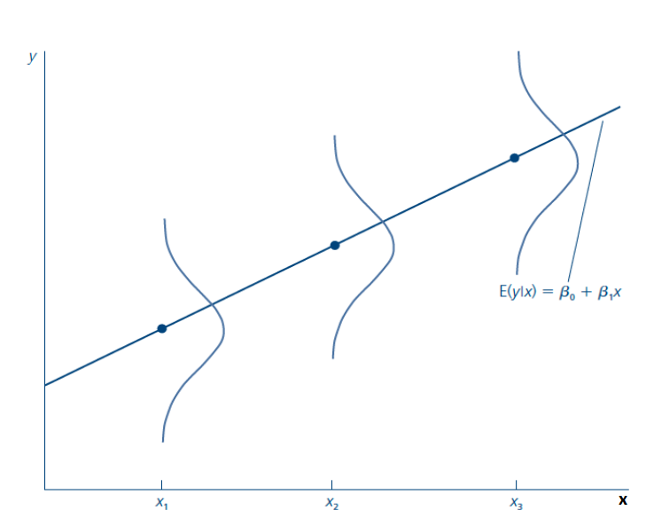
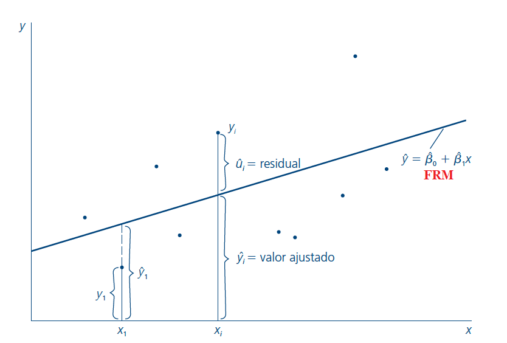
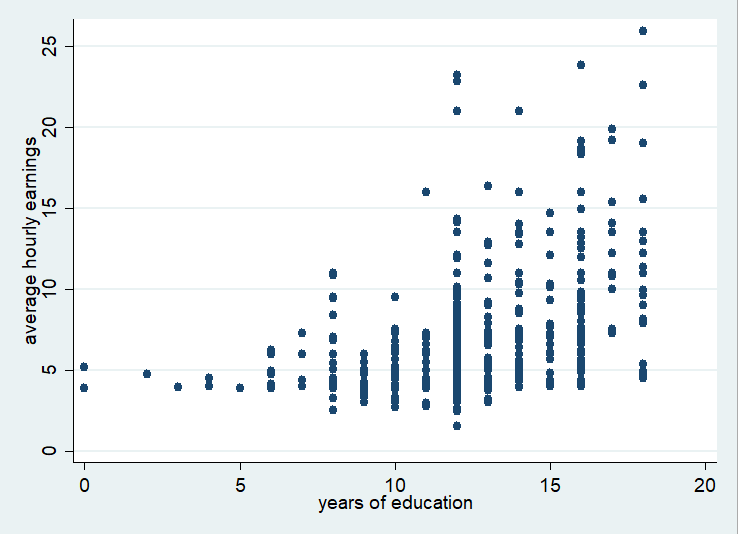
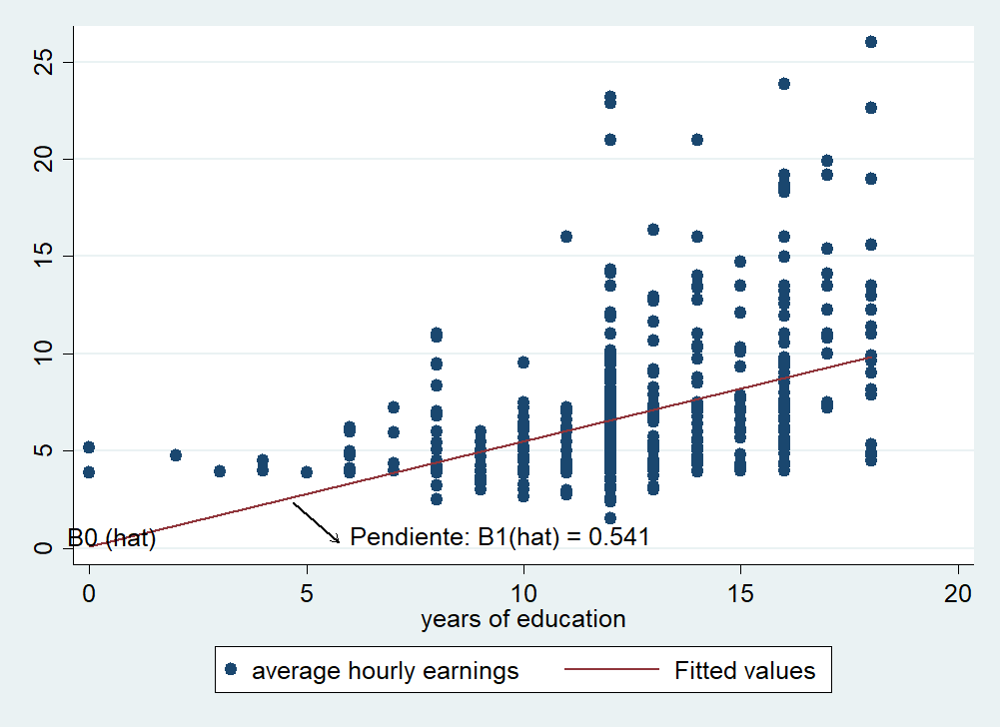

## Regresión lineal simple

Queremos estudiar la relación entre dos variables $x$ e $y$ en la población.

- Explicar $y$ en términos de $x$ o cómo cambia $y$ cuando cambia $x$.
- **Modelo de regresión lineal simple (RLS):**

$$y = \beta_0 + \beta_1 x + u$$

- $\beta_0$, $\beta_1$: **parámetros poblacionales**.
- $u$: término de error — factores no observables que afectan a $y$.
- El coeficiente $\beta_0$ permite suponer que $E(u) = 0$.
- $\beta_1$ captura cómo cambia $y$ cuando cambia $x$.

## Terminología

Dado el modelo $y = \beta_0 + \beta_1 x + u$:

| Símbolo | Nombre |
|---|---|
| $y$ | Variable dependiente, explicada, regresando |
| $x$ | Variable independiente, explicativa, regresor |
| $\beta_1$ | Pendiente: efecto de $x$ sobre $y$, *ceteris paribus* |
| $\beta_0$ | Intercepto o término constante |

## Ejemplo: salario y educación

$$\text{salario} = \beta_0 + \beta_1 \, \text{educación} + u$$

Si todos los demás factores son constantes ($\Delta u = 0$):

$$\Delta \text{salario} = \beta_1 \, \Delta \text{educación}$$

$\beta_1$ es el efecto de la educación cuando los factores **no observables** son constantes.

. . .

> **Pregunta:** En general, ¿son constantes los factores no observables?

# El Supuesto Clave: Media Condicional Cero

## Media condicional cero

- Es difícil decir que $u$ es constante cuando no lo observamos.
- El supuesto clave para estimar $\beta_1$ es:

$$E[u \mid x] = 0$$

- El valor promedio de $u$ es igual para **cualquier** valor de $x$.
- Implica que $x$ no está correlacionada con los factores no observables.

## Supuestos del modelo RLS

1. **Linealidad en los parámetros:** la relación entre $y$ y $x$ es lineal.
2. **Media condicional cero:**

$$E[u \mid x] = E[u] = 0$$

El valor esperado de los factores inobservables no depende de $x$.

**Ejemplo:**

$$\text{Salario} = \beta_0 + \beta_1 \, educ + u$$

¿Qué contiene $u$? ¿Cómo se relaciona con $educ$?

## Regresión poblacional

Si se cumplen los supuestos, a partir de $y = \beta_0 + \beta_1 x + u$ se obtiene:

$$E[y \mid x] = \beta_0 + \beta_1 x$$

La expresión $E[y \mid x]$ se denomina **Función de Regresión Poblacional (FRP)**.

## Esperanza condicional

La esperanza condicional es la media poblacional de $Y_i$ cuando $X_i$ está fijo.

| Individuo | Años educación | Ingreso |
|---|---|---|
| María | 5 | 120 |
| Juan | 5 | 100 |
| Pedro | 4 | 80 |
| Catalina | 2 | 50 |

- $E[Y_i \mid X_i = 5] = 110$
- $E[Y_i \mid X_i = 4] = 80$
- $E[Y_i \mid X_i = 2] = 50$
- $E[Y_i] = 87.5$

## Función de Regresión Poblacional

{fig-align="center" width="80%"}

## Interpretación de los coeficientes

$$E[y \mid x] = \beta_0 + \beta_1 x$$

**Pendiente:**

$$\beta_1 = \frac{\Delta E[y \mid x]}{\Delta x}$$

Cuando $x$ aumenta en una unidad, el valor esperado de $y$ cambia en $\beta_1$ unidades.

**Intercepto:**

$$\beta_0 = E[y \mid x = 0]$$

Es el valor esperado de $y$ cuando $x = 0$.

## Estimación

- Objetivo: estimar los parámetros poblacionales a partir de una muestra.
- Para cada observación $i = 1, \dots, n$:

$$y_i = \beta_0 + \beta_1 x_i + u_i$$

## Mínimos Cuadrados Ordinarios (MCO)

Modelo estimado:

$$\hat{y}_i = \hat{\beta}_0 + \hat{\beta}_1 x_i + \hat{u}_i$$

**Objetivo:** encontrar los estimadores que minimizan la suma de residuos al cuadrado:

$$\min_{\hat{\beta}_0, \hat{\beta}_1} \sum_{i=1}^{n} (y_i - \hat{\beta}_0 - \hat{\beta}_1 x_i)^2$$

## Estimadores MCO

**Intercepto:**

$$\hat{\beta}_0 = \bar{y} - \hat{\beta}_1 \bar{x}$$

**Pendiente:**

$$\hat{\beta}_1 = \frac{\sum_{i=1}^{n} (x_i - \bar{x}) y_i}{\sum_{i=1}^{n} (x_i - \bar{x})^2} = \frac{\text{Cov}(x,y)}{\text{Var}(x)}$$

## Función de Regresión Muestral (FRM)

$$\hat{y} = \hat{\beta}_0 + \hat{\beta}_1 x$$

- La FRM es la versión muestral de la FRP.
- La FRP es desconocida y se aproxima con una muestra.
- $\hat{y}$ es el valor ajustado o predicho.

{fig-align="center" width="70%"}

## Ejemplo: educación y salarios

$$\text{salario}_i = \beta_0 + \beta_1 \, educación_i + \varepsilon_i$$

Datos de 562 individuos:

{fig-align="center" width="70%"}

## Ejemplo: resultado MCO

$$\hat{\text{salario}} = 0.095 + 0.54 \, \text{educación}$$

{fig-align="center" width="70%"}

## Propiedades aritméticas de MCO

1. $\sum_i \hat{u}_i = 0$
2. $\sum_i x_i \hat{u}_i = 0$
3. $\bar{y} = \bar{\hat{y}}$
4. La recta pasa por $(\bar{x}, \bar{y})$

## Descomposición de la varianza

$$SST = \sum_{i=1}^{n} (y_i - \bar{y})^2 \quad \text{(Total)}$$

$$SSE = \sum_{i=1}^{n} (\hat{y}_i - \bar{y})^2 \quad \text{(Explicada)}$$

$$SSR = \sum_{i=1}^{n} \hat{u}_i^2 \quad \text{(Residual)}$$

$$\boxed{SST = SSE + SSR}$$

## Bondad de ajuste: $R^2$

$$R^2 = \frac{SSE}{SST} = 1 - \frac{SSR}{SST}$$

Mide la proporción de la variabilidad de $y$ **explicada por el modelo**.

$R^2 \in [0, 1]$: valores más cercanos a 1 indican mejor ajuste.

## Supuestos RLS adicionales

- Muestra aleatoria.
- Variación en $x$.
- **Homocedasticidad:**

$$Var(u \mid x) = \sigma^2$$

La varianza del error es constante para todo valor de $x$.

## Varianza de los estimadores MCO

$$Var(\hat{\beta}_1) = \frac{\sigma^2}{\sum_{i=1}^n (x_i - \bar{x})^2}$$

$$Var(\hat{\beta}_0) = \frac{\sigma^2 \sum_{i=1}^n x_i^2}{n \sum_{i=1}^n (x_i - \bar{x})^2}$$

```{=html}
<style>
/* Ajusta el tamaño del título y subtítulo */
.reveal .slides h1 {
  font-size: 2em; /* Tamaño más pequeño para el título */
}

.reveal .slides h2 {
  font-size: 1.5em; /* Tamaño más pequeño para el subtítulo */
}

/* Ajusta el tamaño del texto en los párrafos */
.reveal .slides p {
  font-size: 0.8em; /* Texto más pequeño */
}

/* Ajusta el tamaño de las tablas */
.reveal .slides table {
  font-size: 0.8em; /* Tamaño de fuente más pequeño en las tablas */
  width: 90%; /* Ajusta el ancho de la tabla */
  margin: 0 auto; /* Centra la tabla */
}

/* Ajusta el tamaño de los bullets */
.reveal .slides ul {
  font-size: 0.8em; /* Tamaño de fuente más pequeño en los bullets */
}

.reveal .slide-logo {
   max-height: 2em !important;
}
</style>
```
